# 標誌、標線、標字、號誌及手勢講義

資料整理日：2026-06-19  
適用對象：準備台灣普通小型車汽車駕照筆試者  
搭配題庫：[`taiwan-road-signs-markings-signals-must-know-questions.md`](./taiwan-road-signs-markings-signals-must-know-questions.md)

> 本講義依「道路交通標誌標線號誌設置規則」與公路局汽車題庫常考方向整理。圖片為學習用示意圖，用來幫助記憶形狀、顏色與判讀順序；正式考試仍以官方題庫與現場標誌標線為準。

## 參考來源

- 全國法規資料庫「道路交通標誌標線號誌設置規則」：https://law.moj.gov.tw/LawClass/LawAll.aspx?pcode=K0040014
- 交通部公路局「汽車題庫／Cars」：https://www.thb.gov.tw/News_Download.aspx?n=284&sms=12823
- 監理服務網「汽機車線上隨機模擬考系統」：https://www.mvdis.gov.tw/m3-simulator-drv/

## 新增圖片判讀索引

`assets/img001` 到 `img021` 是新增的實拍/掃描圖表。`img003` 目前未出現在資料夾中；現有可用圖片共 20 張。

| 圖片 | 主題 | 建議讀法 |
| --- | --- | --- |
| `img004`, `img001` | 警告標誌 | 先看紅邊三角形，再分彎路、坡路、岔路、行人、動物、落石、危險等圖案。 |
| `img002`, `img005` | 遵行、禁制、限制 | 藍底多是「照此做」，紅圈斜線多是「不得做」，紅圈數字是限制。 |
| `img006` 到 `img010` | 指示、路線、高快速公路、設施、施工 | 綠底看方向與路線，藍底看服務設施，黃橙底看施工與改道。 |
| `img011` 到 `img013`, `img021` | 標線與標線一覽 | 按顏色與線型判斷：白色同向/停等，黃色分向/禁停，紅色禁臨停。 |
| `img014` | 標字 | 直接看路面文字要求：慢、停、速限、禁行、專用、待轉。 |
| `img015` | 號誌與駕駛手勢 | 分清行人號誌、行車號誌、車道管制號誌、平交道號誌。 |
| `img016` | 交通警察指揮 | 以警察右手為右、左手為左；單手高舉多為停止或準備停止。 |
| `img017`, `img018` | 高快速公路 | 出口預告、出口方向、服務區、速限與爬坡道要提早選車道。 |
| `img019`, `img020` | 易混淆比較 | 特別看括號中的「非某標誌」說明，這正是考題常挖的陷阱。 |

## 一、中華民國道路交通標誌

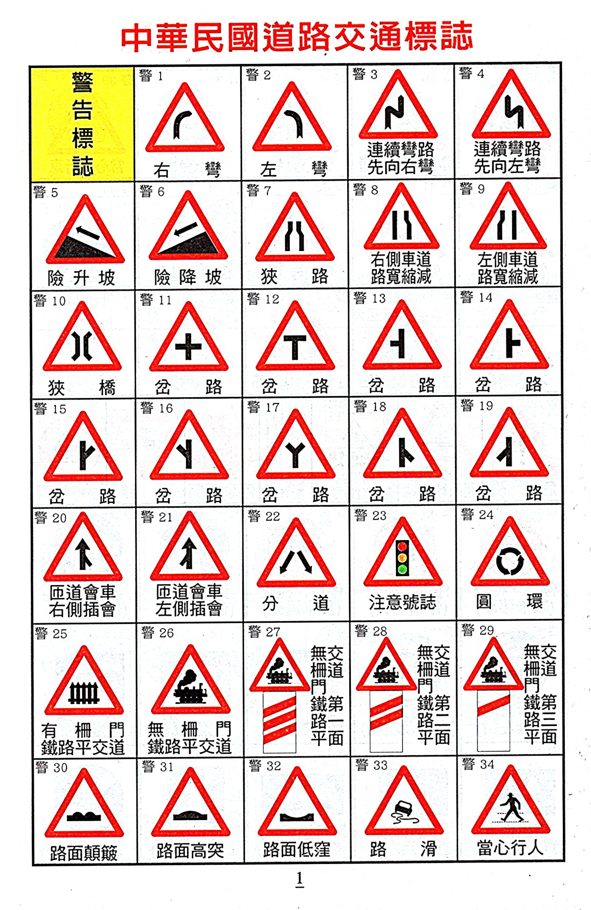

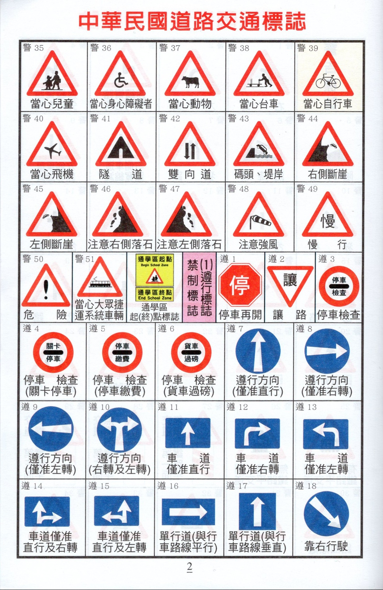

道路交通標誌是安裝於支柱、支架或其他設施上的交通管制設施，用符號、圖案或文字預告、管制或指示前方路況。考試判讀時，不要先死背圖案，應先看「形狀」與「顏色」。

### 1. 標誌四大類

| 類別 | 常見外觀 | 用途 | 考試口訣 |
| --- | --- | --- | --- |
| 警告標誌 | 多為紅邊白底三角形 | 提醒前方有特殊路況 | 看到三角形先減速注意 |
| 禁制標誌 | 多為紅色、圓形、八角形或倒三角形 | 禁止、限制、命令遵行 | 紅色多代表不能做或必須停讓 |
| 指示標誌 | 藍、綠、棕等底色 | 指示路線、方向、地名、設施 | 藍色看遵行與設施，綠色看方向 |
| 輔助標誌 | 小型附牌或告示牌 | 補充距離、時間、車種、範圍 | 要和主標誌一起讀 |

### 2. 顏色判讀

- 紅色：禁制或警告，例如禁止進入、禁止停車、停車再開。
- 黃色：警告，例如彎路、狹路、坡路、注意行人。
- 橙色：施工、養護或交通受阻。
- 藍色：遵行方向、專用車道、公共服務設施。
- 綠色：地名、路線、方向、里程。
- 棕色：觀光、文化設施與自行車路線。
- 黑白：常用於文字、圖案、底色與路線資訊。

### 3. 形狀判讀

- 正三角形：一般警告標誌。
- 菱形：一般施工標誌。
- 圓形：一般禁制標誌或部分路線編號。
- 倒三角形：讓路。
- 八角形：停車再開。
- 交岔形：鐵路平交道。
- 方形或矩形：指示、輔助、車道遵行方向、單行道等。
- 箭頭形：方向里程。
- 梅花形：國道路線編號。
- 盾形：省道路線編號。

### 4. 必背標誌概念

- 停車再開：看到「停」或八角形時，必須完全停止，確認安全後再開。
- 讓路：不一定每次都要停，但必須讓幹道或優先車流先行；必要時應停。
- 禁止進入：不得由該方向進入，不能用「只是一下」作為理由。
- 禁止停車與禁止臨時停車：兩者不同，禁止臨時停車更嚴格。
- 單行道與車道遵行方向：方向箭頭是命令，不是建議。
- 行人穿越道、學校、兒童、當心行人：減速並準備停讓。

### 5. 圖表補充：遵行、禁制、指示與施工

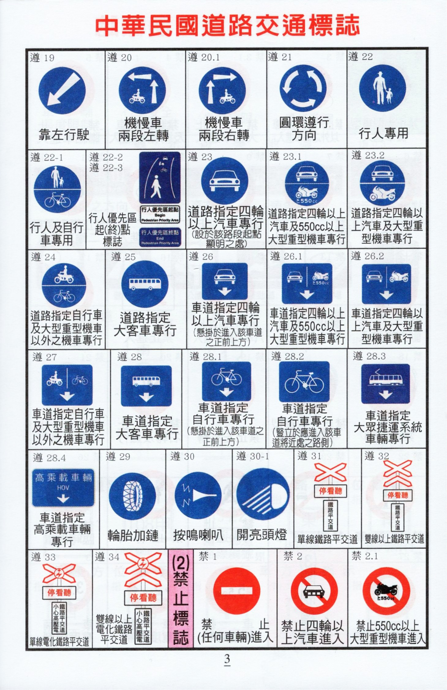

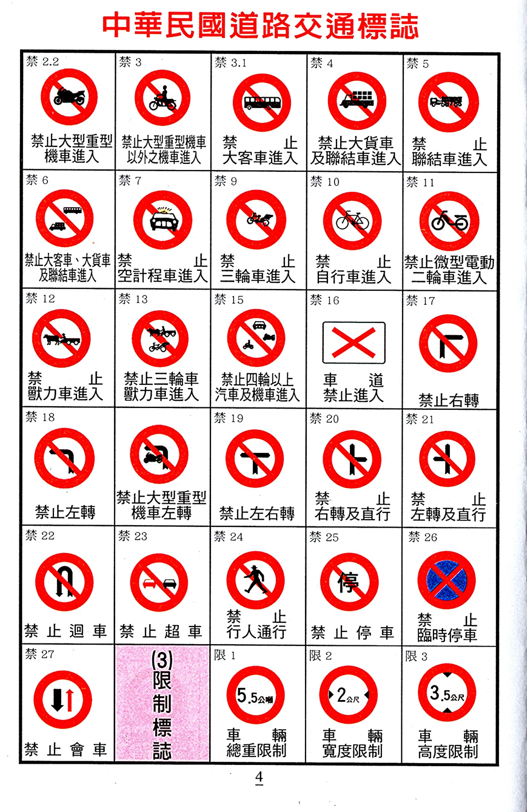

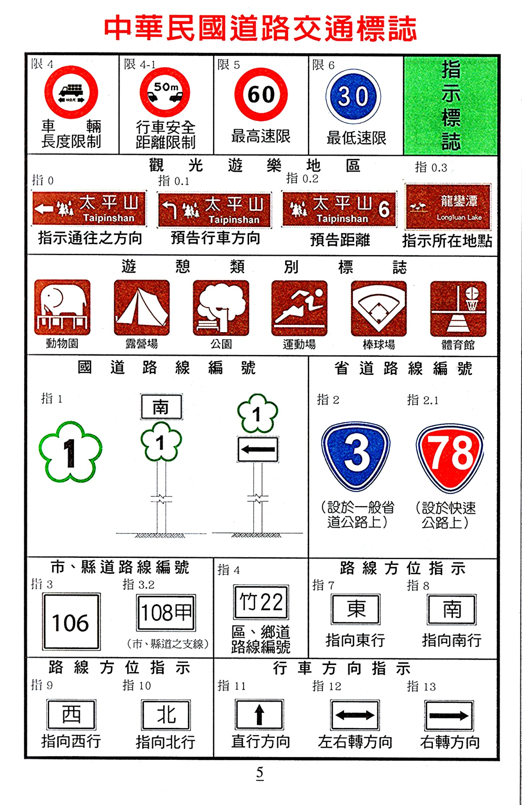

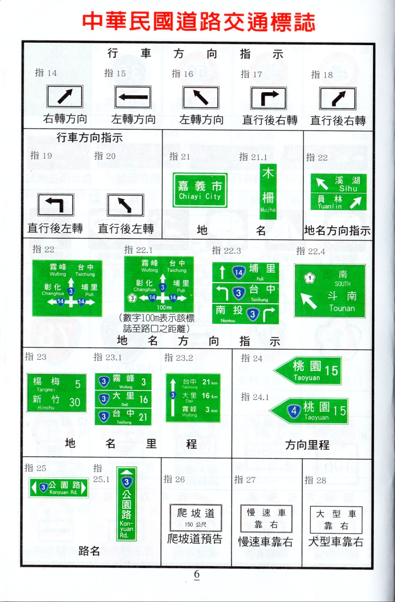

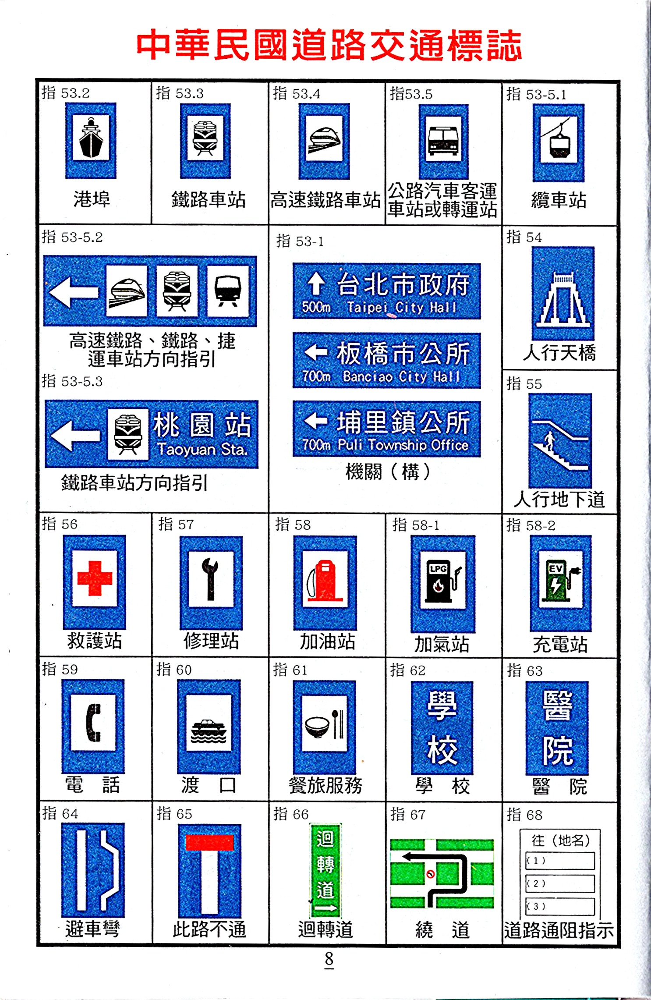

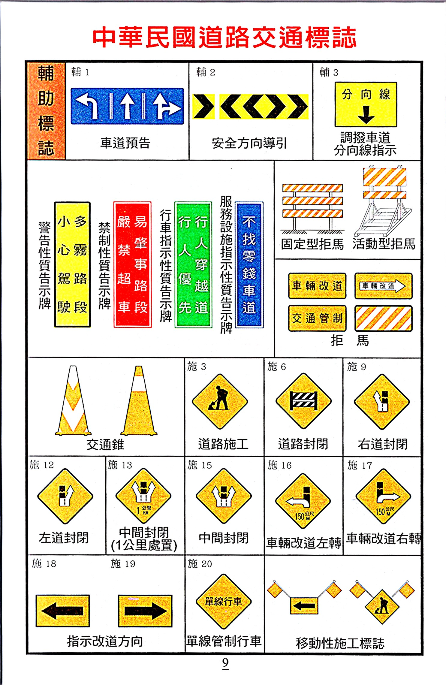

這幾張圖的重點不是逐一背號碼，而是建立分類反射：

- 藍底白箭頭的「遵行方向」代表只能照箭頭方向行駛；白底黑箭頭的「行車方向指示」則多是方向告示或預告。
- 紅圈斜線通常表示禁止特定車種、方向或行為；紅圈數字或尺寸則是重量、寬度、高度、速度等限制。
- 棕底標誌多為觀光遊樂區，藍底白框多為公共服務設施，例如醫院、救護站、加油站、停車處。
- 黃底或橙底施工相關標誌、拒馬、交通錐、車道封閉與改道標誌，表示前方交通型態可能暫時改變，應提前減速並依導引行駛。

## 二、中華民國道路交通標線

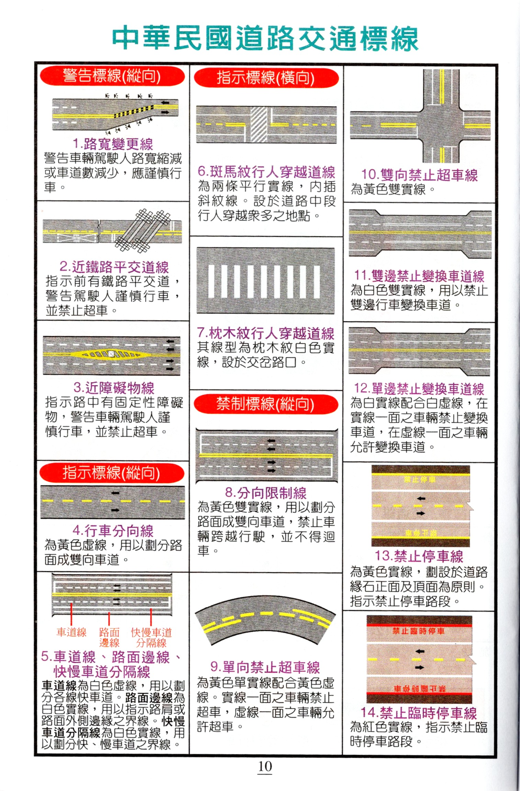

標線是畫設在路面或設施上的線條、圖形、標字或導向裝置，用來管制車輛與行人行止。標線常考「可否跨越」「可否變換車道」「可否停車」。

### 1. 顏色先判斷

| 顏色 | 常見意義 | 考題方向 |
| --- | --- | --- |
| 白色 | 同向車道、停止線、行人穿越道、導向線 | 變換車道、停等位置、禮讓行人 |
| 黃色 | 分隔對向車流、路邊停車限制、警告 | 對向超車、禁止停車、危險區域 |
| 紅色 | 禁止臨時停車 | 路邊不可臨停、上下客也不行 |
| 藍色或綠色 | 特定車種、停車格或專用區域 | 是否具備車種或身分資格 |

### 2. 線型先判斷

- 虛線：通常表示在安全情況下可以跨越或變換。
- 實線：通常表示限制或禁止任意跨越。
- 雙實線：限制更強，常考禁止跨越、禁止變換車道。
- 雙黃線：分隔對向車流，禁止跨越至對向車道。
- 槽化線：導引車流或分隔交通，不得任意穿越或停車。
- 停止線：紅燈、停車再開或警察指揮停止時，應停在線前。

### 3. 常考標線

- 車道線：同向車道分隔，白虛線可在安全時變換。
- 禁止變換車道線：常見白實線或雙白實線，表示不得任意變換。
- 行人穿越道線：車輛應減速，行人穿越時應停讓。
- 停止線：不得越線停等。
- 枕木紋行人穿越道：遇行人優先。
- 網狀線：不得停留占用，避免堵塞路口。
- 路邊紅線：禁止臨時停車。
- 路邊黃線：禁止停車，依標誌、時段或規定判斷可否臨停。

### 4. 圖表補充：停止線、讓路線、網狀線與待轉區

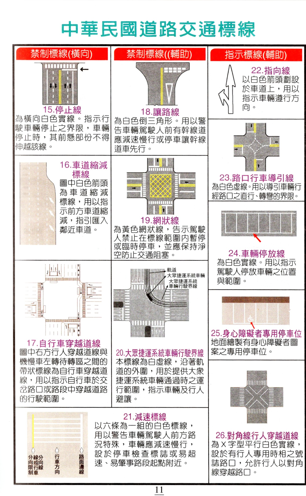

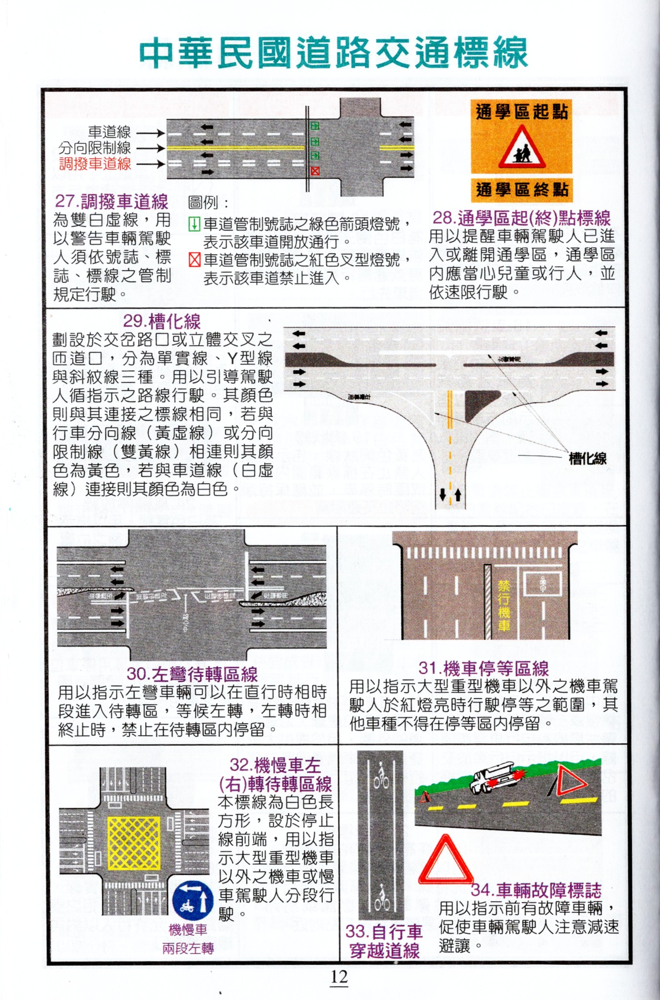

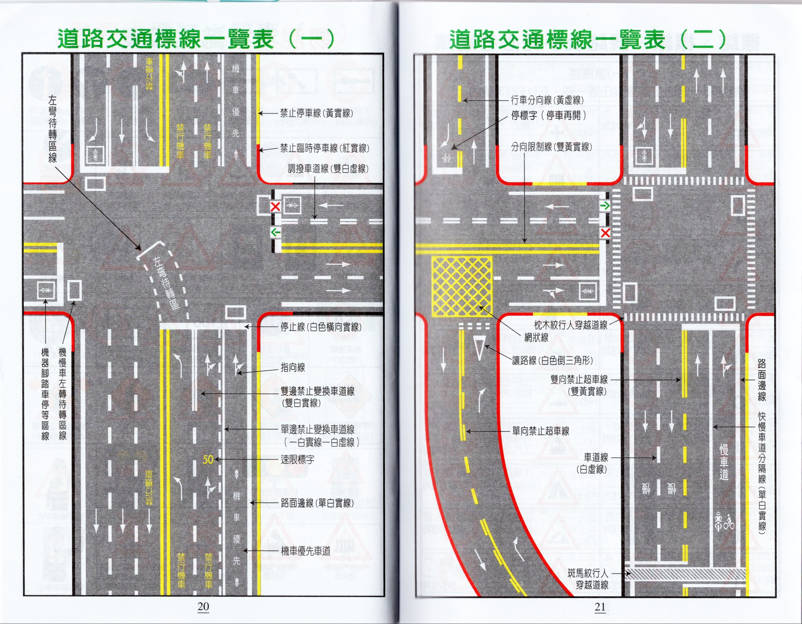

標線圖表可用下列順序判讀：

- 先看路口前方是否有停止線、讓路線、行人穿越道或網狀線，這些直接決定是否能進入路口。
- 再看車道線是白虛線、白實線、雙白實線、黃虛線、黃實線或雙黃線，決定可否變換、超車或跨越。
- 機車停等區、機車兩段式左轉待轉區、自行車穿越道線與機車優先車道，多與汽車駕駛的禮讓和不得占用有關。
- 槽化線、車道縮減標線、調撥車道線、車道管制號誌要合併判斷，不可只看其中一種設施。

## 三、中華民國道路交通標字

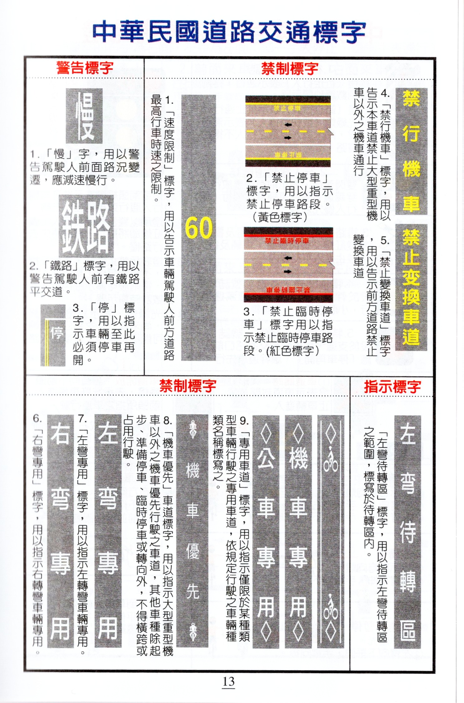

標字是標線的一種，用文字或數字直接標在路面上，提醒或命令駕駛人遵行。考題常把標字、箭頭、車道用途和號誌一起考。

### 1. 常見標字

| 標字 | 意義 | 考試判斷 |
| --- | --- | --- |
| 停 | 前方應停止或停等 | 遇紅燈、停車再開、警察指揮時要在線前停 |
| 讓 | 應禮讓優先車流或行人 | 必要時停車讓行 |
| 慢 | 減速慢行 | 不是只鬆油門，要能應變停車 |
| 公車專用 | 該車道供公車或指定車輛使用 | 一般小客車不得任意占用 |
| 機車優先 | 機車優先或專用語境 | 小客車要看車道標誌與標線，不可誤入 |
| 數字速限 | 路段速限或車道速限 | 不得超速，仍需配合現場標誌 |
| 方向箭頭 | 車道可行方向 | 到路口才臨時切換容易違規 |
| 禁行機車 | 大型重型機車以外機車禁止通行 | 汽車題常用來測「標字也有管制效力」 |
| 禁止變換車道 | 前方道路禁止變換車道 | 需配合白實線、雙白實線或車道管制號誌 |
| 左彎待轉區 | 指示左轉待轉範圍 | 不是一般停車格，不可任意停留 |

### 2. 標字讀法

1. 先看標字所在車道。
2. 再看同車道箭頭。
3. 接著看路口號誌與標誌。
4. 若警察指揮不同，依警察指揮。

## 四、中華民國道路交通號誌燈

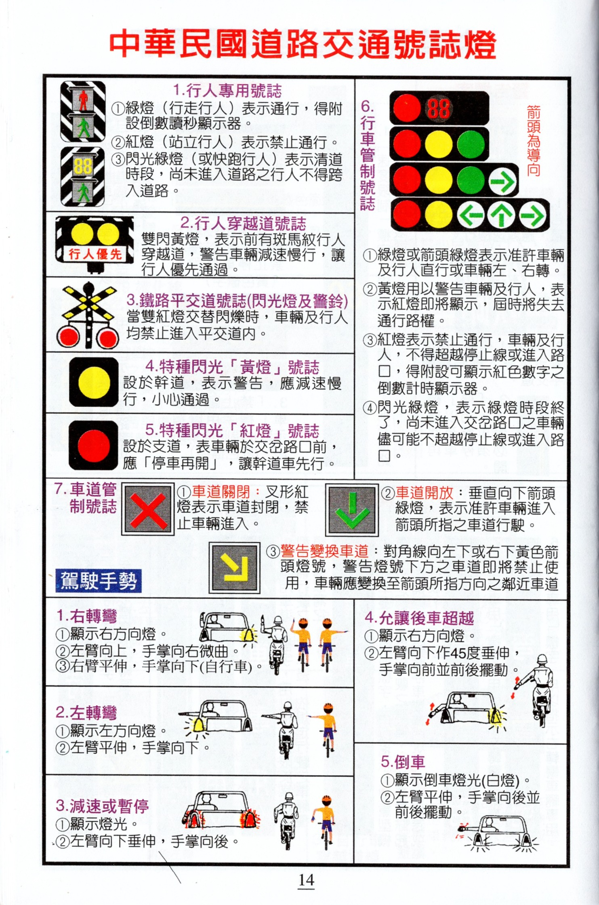

號誌用交互更迭的光色訊號分配通行權。筆試最常考紅、黃、綠、箭頭、閃光號誌與警察指揮優先順序。

### 1. 一般燈號

| 燈號 | 意義 | 考試重點 |
| --- | --- | --- |
| 紅燈 | 停止 | 不得越過停止線；不可任意右轉 |
| 黃燈 | 警告燈號即將改變 | 能安全停止就停；已太近無法安全停止才續行 |
| 綠燈 | 可通行 | 仍須注意路口淨空、行人與轉彎車 |
| 綠箭頭 | 依箭頭方向通行 | 只准箭頭方向，不代表其他方向也可走 |
| 閃光紅燈 | 停車再開 | 完全停止，確認安全再行 |
| 閃光黃燈 | 減速注意 | 可通行但須注意安全 |

### 2. 行人與車輛號誌

- 行人專用號誌不是車輛通行許可。
- 車輛綠燈左轉、右轉時，仍應禮讓行人。
- 路口堵塞時，即使綠燈也不應進入路口造成阻塞。
- 號誌、標誌、標線不一致時，依實際優先順序判斷。

### 3. 優先順序

1. 交通警察或依法執行指揮人員。
2. 號誌。
3. 標誌。
4. 標線。
5. 一般道路交通安全規則與路權原則。

### 4. 車道管制號誌

- 紅色叉形燈號：該車道關閉，禁止進入。
- 綠色向下箭頭：該車道開放，准許進入箭頭所指車道。
- 黃色斜向箭頭：警告該車道即將禁止使用，車輛應變換至箭頭所指方向鄰近車道。
- 車道管制號誌常出現在隧道、橋梁、調撥車道或施工路段，必須和地面調撥車道線一起看。

## 五、交通警察指揮手勢圖解

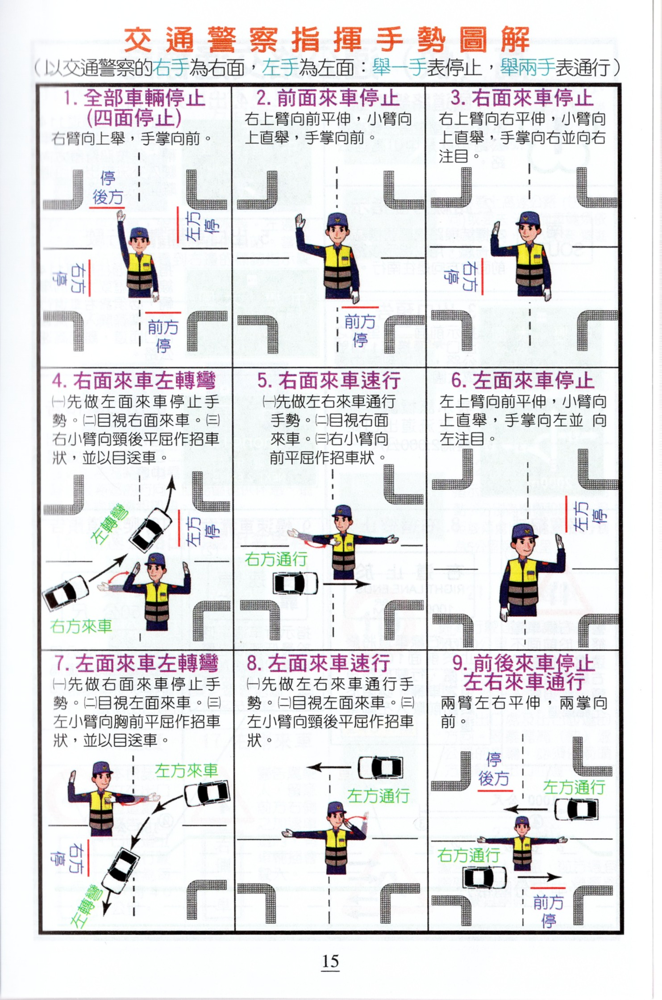

交通警察指揮是最高優先。只要警察指揮與紅綠燈、標誌、標線不同，應依警察指揮，不可自行選擇對自己有利的號誌。

### 1. 常考手勢判讀

| 手勢 | 判讀方式 | 考試重點 |
| --- | --- | --- |
| 雙臂平伸 | 面向或背向警察的車流通常停止 | 不要只看自己車道燈號 |
| 單臂高舉 | 各方向準備停止 | 類似黃燈轉換概念，注意停止 |
| 手臂招呼 | 依手臂揮動方向通行 | 被指揮通行才可走 |
| 指示轉彎或靠邊 | 依指示方向行駛或停靠 | 不可與警察爭辯現場標誌 |

### 2. 實戰判斷

- 看警察身體朝向與手臂方向。
- 若不確定，先減速或停止，等待明確指示。
- 不可因後車催促而闖越指揮。
- 執勤人員、義交或依法指揮人員的指揮也應遵守。

### 3. 手勢記憶法

- 以交通警察的右手為右面、左手為左面，不是以駕駛人自己的左右判斷。
- 單手向上、手掌向前，多表示停止或準備停止。
- 兩臂左右平伸時，通常是前後來車停止、左右來車通行；但仍要看警察面向與手勢細節。
- 有招車手勢時，只有被招呼的方向可通行，其他方向仍應停止或等待。

## 六、高(快)速公路交通標誌

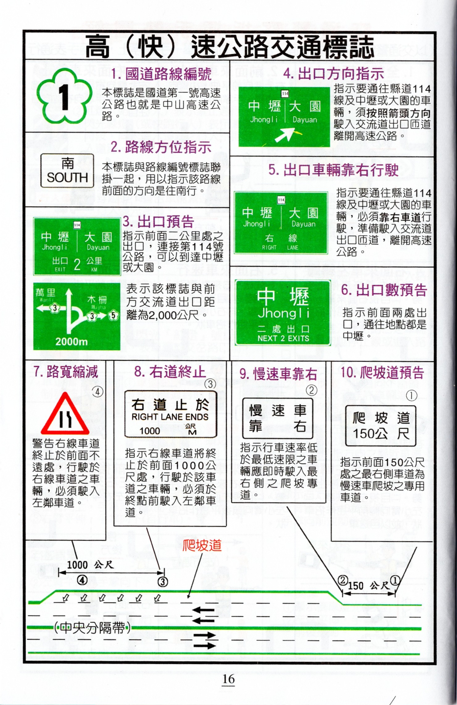

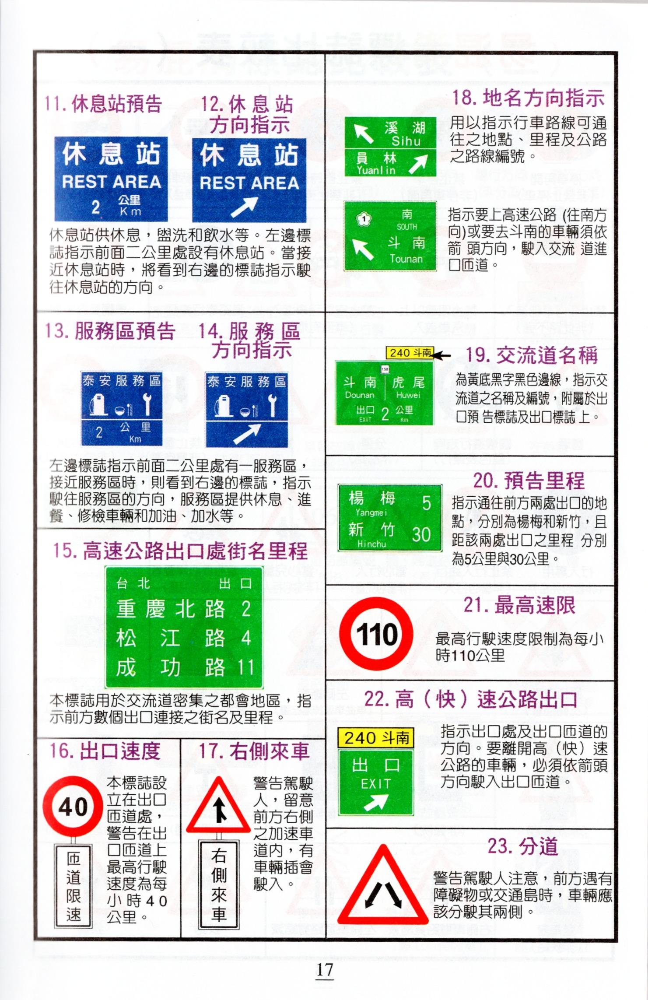

高快速公路速度高，標誌通常提前預告出口、路線、里程、速限、車道管制與服務設施。考試重點不是只認牌子，而是理解「看到後應提早做什麼」。

### 1. 常見類型

- 路線編號：國道多用梅花形，省道多用盾形。
- 出口預告：告知出口編號、地名、方向與距離。
- 方向里程：綠底白字，指示目的地與距離。
- 速限標誌：最高速限、最低速限、匝道速限。
- 車道管制：指定車道、封閉車道、施工改道。
- 服務設施：服務區、休息站、加油站、廁所、停車場。

### 2. 高快速公路必考行為

- 要下交流道應提早變換到外側車道，不可臨時急切。
- 錯過出口不可倒車、迴轉或逆向行駛。
- 匝道速限通常低於主線，應提前減速。
- 內側車道不是長期慢速行駛車道。
- 故障時應依規定放置故障標誌並避至安全處。
- 施工標誌與改道標線要優先注意。

### 3. 出口與服務區讀法

- 出口預告常標示「出口 2 公里」或「前方 2000 公尺」，看到後就要開始選車道。
- 出口方向指示與「右線」代表要離開主線的車輛需依箭頭或指定車道行駛。
- 服務區、休息站預告通常以藍底標誌表示，內容可能包含加油、餐旅、修車、廁所、停車等服務。
- 爬坡道、慢速車靠右、右道終止與路寬縮減標誌，都要求駕駛提早調整速度和車道。

## 七、易混淆標誌比較表

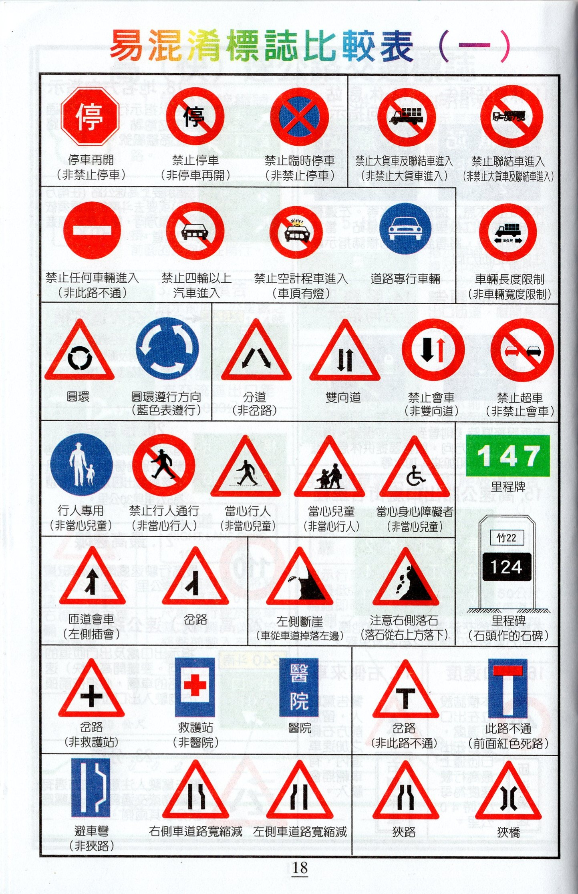

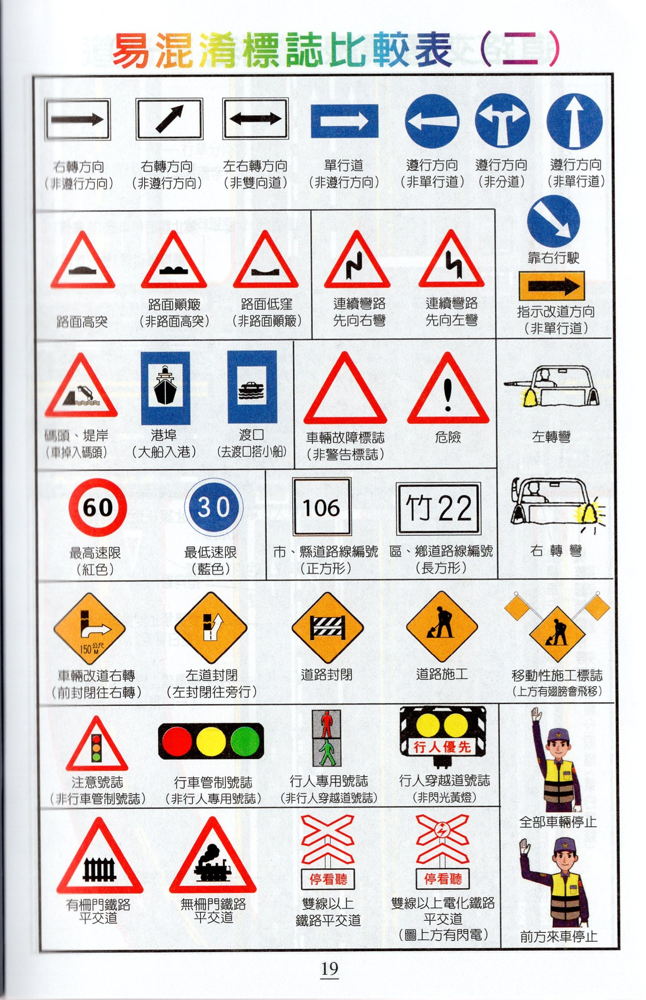

| 易混淆項目 | 差異 | 筆試判斷 |
| --- | --- | --- |
| 禁止停車 vs 禁止臨時停車 | 禁止臨時停車更嚴格 | 紅線或雙斜線語境通常不能上下客貨 |
| 讓路 vs 停車再開 | 讓路不一定停；停車再開必停 | 八角形或「停」要完全停止 |
| 白虛線 vs 白實線 | 虛線可在安全時跨越；實線限制跨越 | 變換車道題先看虛實 |
| 黃線 vs 白線 | 黃線多與對向分隔或路邊限制有關 | 不要把黃線當同向車道線 |
| 綠燈 vs 綠箭頭 | 綠燈可依一般方向通行；綠箭頭只准箭頭方向 | 只有箭頭亮時，不可走其他方向 |
| 指示標誌 vs 禁制標誌 | 指示提供資訊或遵行方向；禁制有禁止或限制效力 | 紅色限制性較強 |
| 圓環 vs 圓環遵行方向 | 三角形圓環是警告；藍底圓形箭頭是遵行方向 | 前者提醒前方圓環，後者命令依方向行駛 |
| 分道 vs 雙向道 | 分道警告前方有障礙物或交通島；雙向道表示前方雙向通行 | 不要把分道誤認為公路入口 |
| 路面高突、顛簸、低窪 | 都是路面狀況警告，但圖形不同 | 都應減速，題目問名稱時要看圖案凸起或凹陷 |
| 最高速限 vs 最低速限 | 最高速限是紅圈，最低速限是藍圈 | 看到藍圈數字不是建議速限 |
| 有柵門 vs 無柵門平交道 | 都是平交道警告，圖案不同 | 平交道前均應注意停看聽 |
| 港埠 vs 渡口 | 港埠偏大型船舶港口，渡口偏車輛或小船渡運 | 圖案不同，藍底仍屬設施指示 |

## 八、道路交通標線一覽表

| 標線 | 常見外觀 | 作用 | 考試重點 |
| --- | --- | --- | --- |
| 車道線 | 白虛線 | 分隔同向車道 | 安全時可變換車道 |
| 禁止變換車道線 | 白實線或雙白實線 | 限制車輛跨越 | 不得任意變換車道 |
| 分向限制線 | 黃線、雙黃線 | 分隔對向車流 | 不得跨越至對向車道 |
| 停止線 | 路口前白實線 | 指示停止位置 | 紅燈或停車再開不可越線 |
| 行人穿越道線 | 斑馬線或枕木紋 | 供行人穿越 | 行人優先，車輛應禮讓 |
| 槽化線 | 斜線區域 | 導引或分隔車流 | 不得任意駛入、停車 |
| 網狀線 | 路口或易阻塞處網格 | 避免車輛停留堵塞 | 前方無法通過時不可進入 |
| 路邊紅線 | 紅色實線 | 禁止臨時停車 | 上下客貨也不可 |
| 路邊黃線 | 黃色實線 | 禁止停車或時段限制 | 需看標誌、時間與現場規定 |
| 導向箭頭 | 白色箭頭 | 指示車道行進方向 | 不得到路口才臨時切換 |

## 考前 10 分鐘速讀

1. 警察指揮優先於號誌，號誌優先於標誌，標誌優先於標線。
2. 紅燈停，黃燈能安全停就停，綠燈也要看行人與路口淨空。
3. 閃紅燈等於停車再開；閃黃燈等於減速注意。
4. 八角形「停」必須完全停止。
5. 倒三角形「讓」要讓優先車流，必要時停。
6. 白虛線可在安全時變換，白實線與雙白實線不得任意跨越。
7. 紅線禁止臨時停車，黃線禁止停車或依時段限制。
8. 行人穿越道與學校、兒童、當心行人相關標誌，一律準備減速停讓。
9. 高快速公路錯過出口不可倒車、逆向或迴轉。
10. 看到附牌，要把時間、距離、車種和主標誌一起讀。
